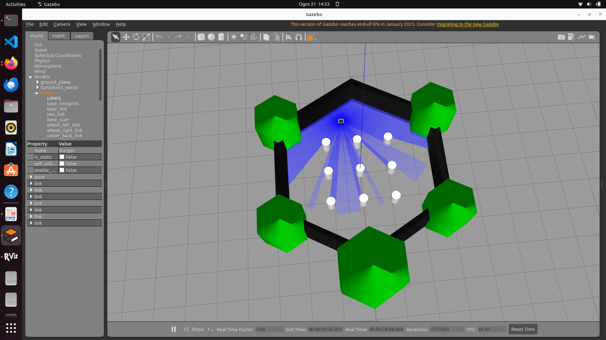
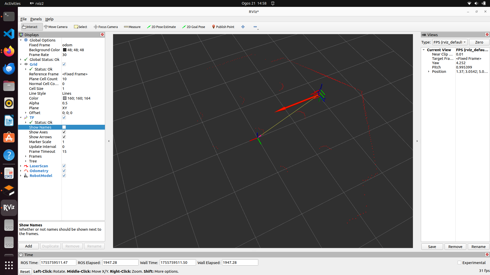
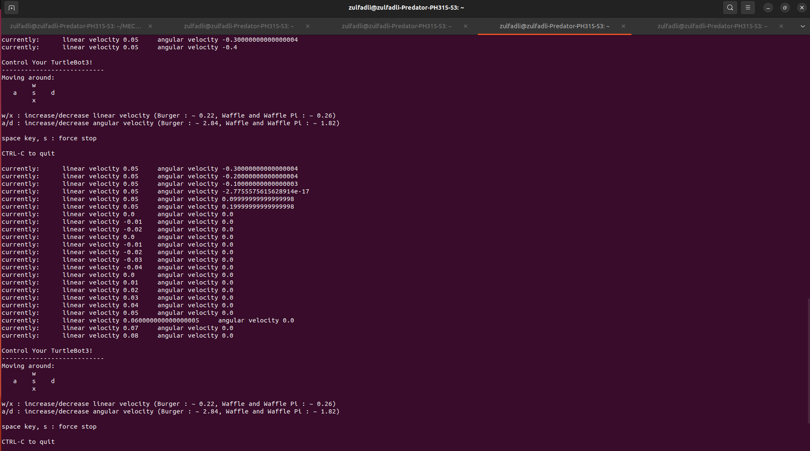
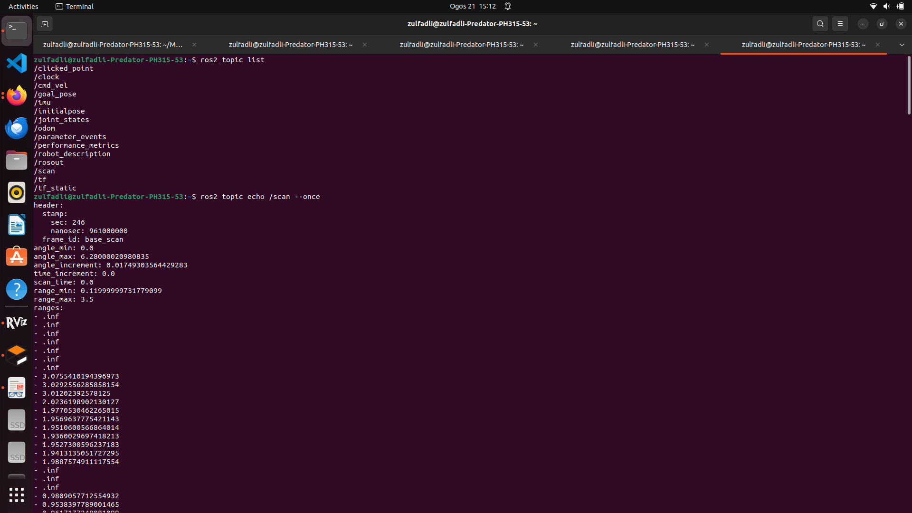

# MEC787

# Task 1: ROS 2 Simulation with TurtleBot3

## System Information
OS: Ubuntu 22.04 LTS
ROS 2 Version: Humble Hawksbill
	
## Installation Commands
sudo apt update && sudo apt upgrade -y
sudo apt install ros-humble-desktop -y
echo "source /opt/ros/humble/setup.bash" >> ~/.bashrc
source ~/.bashrc

echo $ROS_DISTRO  # Output: humble

sudo apt install -y ros-humble-gazebo-ros-pkgs ros-humble-gazebo-ros
sudo apt install -y ros-humble-turtlebot3* ros-humble-turtlebot3-simulations

echo "export TURTLEBOT3_MODEL=burger" >> ~/.bashrc
source ~/.bashrc

## Screenshots

### ROS 2 Version

### Gazebo with TurtleBot3

### RViz2 with LaserScan

### Teleop Running

### Topic List

## Issues & Fixes
**Issue:** Teleop keys did not move the robot.
**Fix:** Needed to focus the teleop terminal window before pressing keys.

**Issue:** RViz2 showed "Global Status: Error".
**Fix:** Changed Fixed Frame from `map` to `odom`.

## Student
Muhd Zulfadli Bin Mahmood

